# Project 1 - Gearbox Model

A physical systems engineering project that turns gearbox behaviour into a visible classroom model. The build demonstrates gear meshing, gear-ratio tradeoffs, shaft alignment, and synchroniser-style movement using low-cost fabricated parts.

## Review Summary

| Field | Evidence |
| --- | --- |
| **Status** | Completed portfolio case study |
| **Built** | Low-cost model gearbox prototype for teaching mechanical gear ratios and output-speed changes |
| **Tools and materials** | Fusion 360, 3D printed gears, wood, dowels, bearings, motor, handmade synchroniser components, workshop fabrication |
| **Best evidence** | Full systems report, project overview PDF, CAD renders, block flow diagram, high-level flowchart, gear-ratio planning map |
| **Main technical value** | Mechanical design reasoning, constraint handling, diagnostic testing, and clear systems documentation |

## Problem

Gearbox speed changes are difficult to understand when the gears, shafts, and synchroniser are hidden inside real machinery. The project addresses that learning gap by making the gear train visible enough for classroom explanation.

## Solution

The selected design is a model gearbox built from 3D printed gears, a wooden base/casing, dowel shafts, bearings, and a sliding synchroniser concept. The prototype prioritises visibility, cost control, and safe demonstration over high-load power transfer.

## Technical Evidence

- Compared a multifunction sanding/cleaning tool against a model gearbox and selected the safer, clearer learning-tool concept.
- Modelled the gear layout in Fusion 360 before fabrication.
- Planned gear ratios against tooth count, bearing fit, printable gear size, and centre-distance constraints.
- Built the prototype with 3D printed gears, wood, dowels, bearings, and handmade synchroniser components.
- Ran diagnostic checks for base stability, shaft straightness, gear meshing, synchroniser fit, and gear-pair spacing.
- Documented design modifications when print size, bearing fit, and gear spacing limited the original ratio plan.

## What to Inspect First

- [Full systems engineering report](./Full%20Systems%20Engineering%20Report.pdf) - complete project reasoning and test evidence.
- [Project overview](./Project%20Overview.pdf) - shorter reviewer-facing overview.
- [Engineering design brief](./ENGINEERING_DESIGN_BRIEF.md) - objective, users, requirements, constraints, outcome, and improvements.
- [Block flow diagram image](./Diagrams/Gearbox%20Model%20Block%20Flow%20Diagram.drawio.png) - system-level structure.
- [High-level project flowchart](./Diagrams/Gearbox%20Model%20-%20High%20Level%20Flowchart.png) - process flow.
- [CAD evidence](./CAD%20Models/) - extracted design renders from the report.

## Limitations

- The original source CAD files were not supplied with the report package. This folder preserves extracted CAD image evidence instead.
- No separate software listings were supplied because this was primarily a mechanical systems project.
- Some planned gear ratios were removed after fabrication constraints around print size, bearings, and spacing became clear.

## Project Files

- [Project overview](./Project%20Overview.pdf)
- [Full systems engineering report](./Full%20Systems%20Engineering%20Report.pdf)
- [Engineering design brief](./ENGINEERING_DESIGN_BRIEF.md)
- [CAD evidence](./CAD%20Models/)
- [Diagrams](./Diagrams/)
- [Code/source availability note](./Code%20Revisions/)
