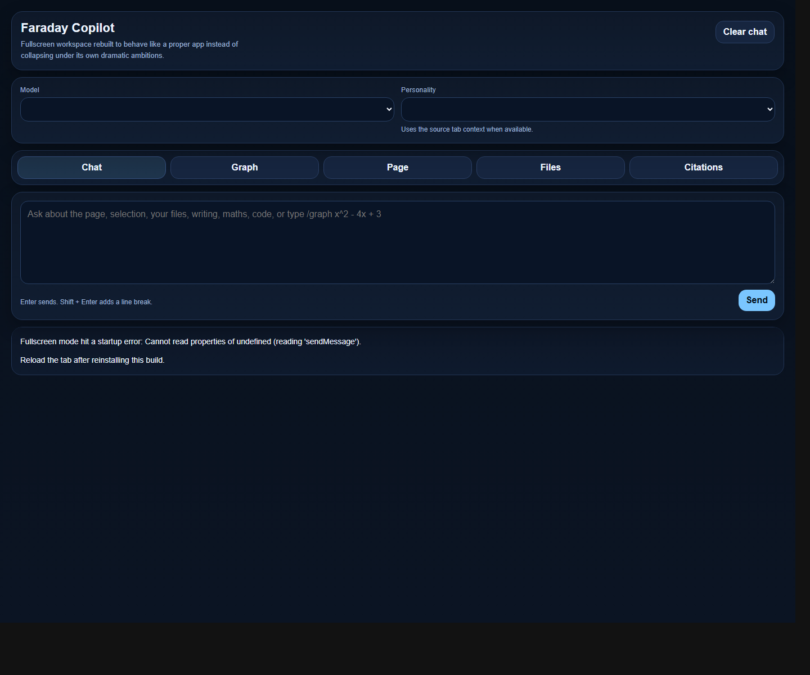
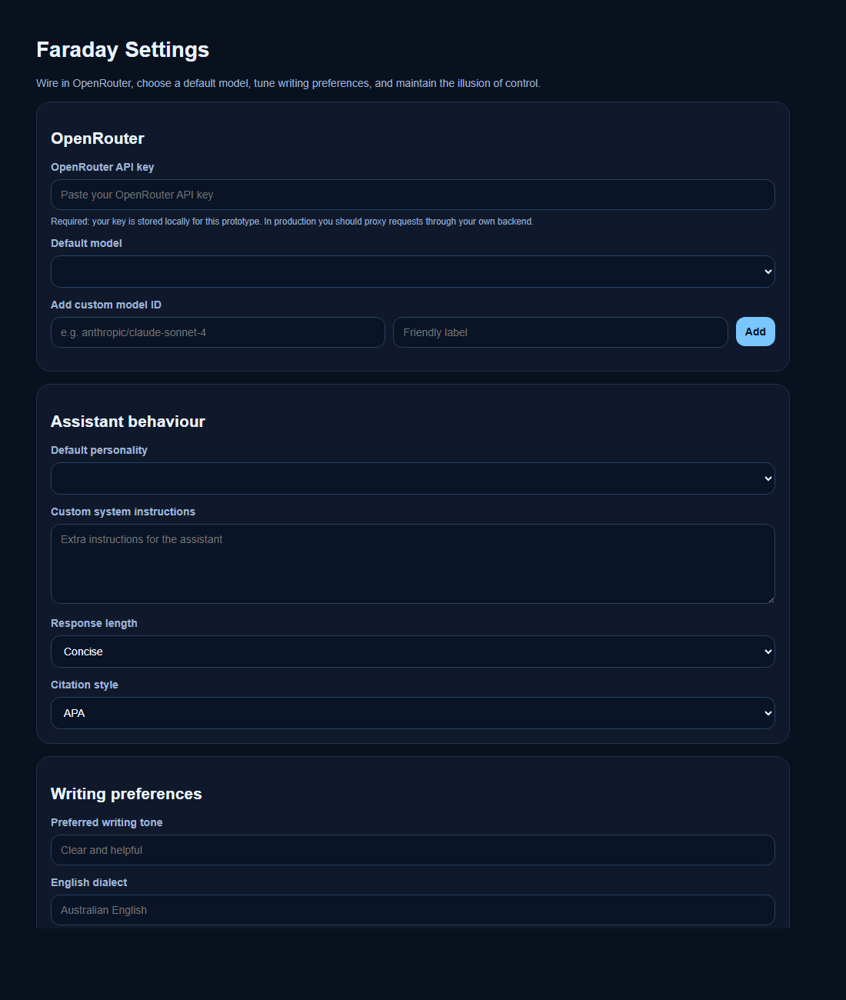

# Professional Design Brief

## Project title

Faraday Copilot - Browser-native AI research and study assistant

## Project type

Personal engineering prototype, Chrome extension, AI assistant, study tooling, productivity software

## Problem statement

Students, researchers, and knowledge workers often switch between webpages, notes, Google Docs, citation tools, graphing tools, and standalone AI chat apps. This context switching slows down research and makes it easy to lose source context.

Faraday Copilot explores a browser-native alternative: keep AI assistance beside the content being read or written, let the assistant see structured page context, and give the user quick actions directly from selected text.

## Target users

- Students studying online material.
- Researchers collecting citations and summaries.
- Writers editing draft work in Google Docs.
- Technical learners who need explanations, flashcards, notes, and simple graphing.
- Power users who prefer configurable AI models.

## Design goals

- Keep assistance attached to the active browser tab.
- Make selected text actionable without copying and pasting into another app.
- Support both quick actions and longer open-ended chat.
- Preserve user state across sessions.
- Provide transparent settings for model choice and writing preferences.
- Support messy real-world surfaces such as Google Docs.
- Add STEM utility through graphing and mathematical analysis.

## Feature requirements

- Page-aware chat in Chrome side panel.
- Context menu and floating highlight toolbar actions.
- OpenRouter model configuration.
- Citation generation and saved citation notebook.
- Google Docs reading support through a companion script.
- File upload payload support for text-based prompts.
- Quiz, flashcard, study-note, summary, rewrite, and explanation workflows.
- Graphing from typed expressions or `/graph` prompts.
- Fullscreen workspace for deeper work.

## Technical constraints

- Chrome Manifest V3 service workers have limited lifetime and different fetch/messaging constraints from normal web apps.
- Content scripts cannot reliably read all Google Docs content through the DOM.
- Extension UI pages depend on Chrome extension APIs and do not fully run when opened as normal local HTML files.
- Storing an API key in extension local storage is acceptable for a prototype but not production-grade.
- The project intentionally uses vanilla HTML, CSS, and JavaScript rather than a framework.

## Design evolution

The project began as a local AI side-panel prototype, then moved into a more capable OpenRouter-powered product. The largest design lesson was that feature growth can make a single side panel feel crowded. Later versions therefore introduced tabs, a dedicated graph workspace, and a fullscreen app page.

The `V6 - Failed UI` branch is retained because it shows a realistic design failure: a large interface expansion increased complexity faster than usability. The subsequent UI revision and final fullscreen rebuild show recovery through clearer interface separation.

## Final design direction

The final preserved design separates the experience into two modes:

- Side panel: fast actions, page context, chat, files, graph, and citation management.
- Fullscreen app: larger workspace for longer prompts, analysis, graphing, and review.

This two-mode design is stronger than trying to fit every workflow into a narrow panel.

## Evidence

## Success criteria

The prototype is successful if it demonstrates:

- A working Chrome extension architecture.
- Clear API integration boundaries.
- Functional browser context capture.
- A credible Google Docs extraction strategy.
- Persistent settings and user workflows.
- Visible product iteration over multiple versions.
- A final project package that a reviewer can inspect without needing the original working directory.

## Production roadmap

- Replace local API key storage with a backend proxy.
- Add streaming response rendering.
- Add automated unit tests around citations, graph parsing, and storage.
- Improve Google Docs editing and insertion.
- Add export formats for study materials.
- Package a release build with icons, privacy notes, and installation documentation.
