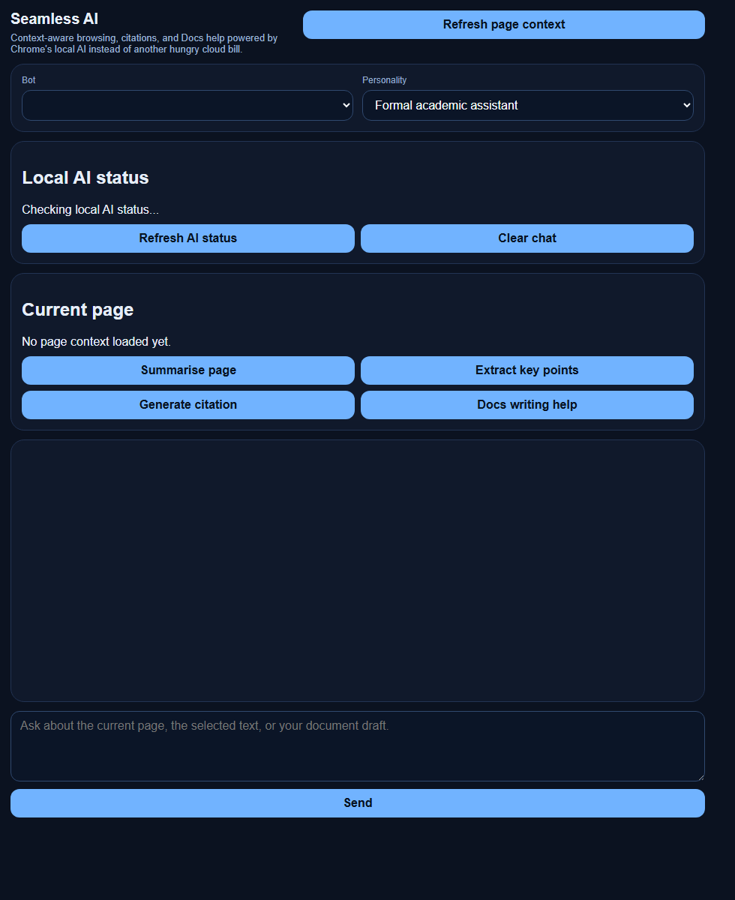

# Faraday Copilot Project Overview

## Project goal

Faraday Copilot was built as a smart Chrome AI assistant for research, study, writing, citations, Google Docs support, and maths graphing. The project evolved from a local Chrome AI experiment into an OpenRouter-powered browser copilot with a persistent side panel and a rebuilt fullscreen workspace.

The core design challenge was to make AI assistance feel attached to the user's active browser context rather than isolated in a separate chat page. The extension reads page context, captures selected text, routes actions from content scripts to a side panel, and stores useful outputs such as citations and chat history.

## Final user experience

The latest version, `Faraday extension V8`, provides:

- Side-panel chat tied to the current browser tab.
- Highlight toolbar actions for explain, ask AI, cite, summarise, rewrite, flashcards, and notes.
- OpenRouter model selection with custom model support.
- Google Docs assistance through a structured Apps Script companion.
- Citation generation and a saved citation notebook.
- Session file upload support for text-based prompts.
- Tabbed navigation for chat, graphing, page context, files, and citations.
- Fullscreen workspace for larger writing, research, and graphing tasks.
- Custom graph engine with expression parsing and mathematical analysis.

## Engineering scope

This project demonstrates a practical full-stack-adjacent browser extension architecture:

- `manifest.json` defines Manifest V3 permissions, content scripts, side panel, options page, service worker, and web-accessible Google Docs bridge.
- `background.js` coordinates context-menu actions, side-panel opening, tab context requests, settings, OpenRouter requests, Google Docs companion fetches, and fullscreen app launch.
- `content-script.js` injects UI controls, extracts page context, captures selected text, handles Google Docs extraction, and sends actions back to the extension.
- `lib/openrouter.js` isolates the OpenRouter API call logic.
- `lib/storage.js` centralises default settings, model catalogues, personalities, chat history, pending actions, files, and citations.
- `sidepanel.html`, `sidepanel.css`, and `sidepanel.js` implement the main extension interface.
- `app.html`, `app.css`, and `app.js` implement the fullscreen app workspace in the final build.
- `apps-script/Code.gs` provides a deployable Google Docs companion for structured document snapshots.

## Evolution summary

The project moved through five major engineering phases:

1. Local Chrome AI prototype: proved the browser-side assistant concept.
2. OpenRouter migration: replaced local AI with configurable cloud model calls and added richer assistant workflows.
3. Google Docs integration: added hybrid extraction, then strict companion mode, then background-fetched diagnostics to avoid cross-origin failures.
4. UI expansion: introduced tabbed navigation, file workflows, citation notebook, and graph tooling.
5. Fullscreen rebuild: separated the full app into dedicated CSS and JavaScript, added stateful view persistence, and deepened the graph engine.

## Evidence of iteration

The preserved versions show both successful upgrades and learning branches. For example, `V6 - Failed UI` is retained because it demonstrates a real design iteration: a large interface change increased code volume but needed revision. `V5 UI Revision` then narrows and stabilises the UI direction before `V7` and `V8` rebuild the fullscreen graph workspace more cleanly.

The `Gemini experimental` folder is also retained. A code comparison found it to be functionally identical to the `V5 UI Revision` snapshot, so it is documented as an experiment branch placeholder rather than a completed provider migration.

## Technical skills demonstrated

- Chrome extension Manifest V3 structure.
- Background service worker messaging.
- Content script injection and DOM extraction.
- Context menu and side panel APIs.
- Local extension storage.
- API integration with OpenRouter's OpenAI-compatible chat-completions endpoint.
- Google Apps Script companion integration.
- Defensive handling of Google Docs extraction failure modes.
- Vanilla JavaScript UI state management.
- Canvas graph rendering.
- Mathematical expression parsing and numerical analysis.
- Iterative product design and prototype documentation.

## Recommended future upgrades

- Move OpenRouter calls behind a backend proxy so API keys are not stored in the extension.
- Add streaming AI responses.
- Add automated tests for expression parsing, graph analysis, citation generation, and storage migrations.
- Convert repeated UI logic into smaller modules.
- Improve Google Docs write-back support with anchored edits.
- Add packaging instructions for a Chrome Web Store-ready build.
