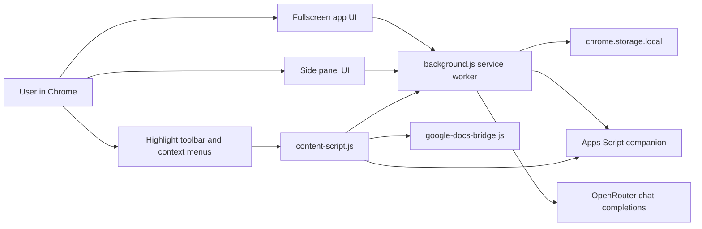

# Technical Architecture

## Architecture overview

Faraday Copilot is a Chrome Manifest V3 extension. It uses a background service worker for orchestration, content scripts for page interaction, extension pages for the UI, and local extension storage for persistent state.

The Mermaid source is also saved in `Diagrams/system-architecture.mmd`.

## Main modules

### Manifest

`manifest.json` defines:

- Manifest version 3.
- Extension name and version.
- Permissions for storage, active tabs, scripting, context menus, side panel, and clipboard writes.
- Host permissions for webpages, OpenRouter, Google Docs, and Apps Script.
- Background service worker.
- Popup, side panel, options page, and content scripts.
- Web-accessible Google Docs bridge file.

### Background service worker

`background.js` is the coordination layer. It:

- Registers context menu actions.
- Opens the side panel.
- Queues selected-text actions.
- Retrieves active page context from the current tab.
- Stores citations.
- Reads and saves settings.
- Calls OpenRouter through `lib/openrouter.js`.
- Fetches Google Docs companion snapshots from the background worker.
- Opens the fullscreen app with source tab context in the final version.

### Content script

`content-script.js` is the page-facing layer. It:

- Injects floating selection controls.
- Adds a Google Docs toolbar when enabled.
- Extracts page title, URL, metadata, visible text, headings, lists, and tables.
- Detects Google Docs IDs.
- Requests structured Docs snapshots.
- Creates citations from page metadata.
- Sends action requests to the background service worker.

### Storage layer

`lib/storage.js` centralises:

- Default model list.
- Default personalities.
- User settings.
- Chat history.
- Citation notebook.
- Session files.
- Pending panel action state.
- Active panel/fullscreen view state.

### OpenRouter adapter

`lib/openrouter.js` isolates API communication. It builds an OpenAI-compatible chat-completions request containing the system prompt, active personality, page context, selection text, file payloads, and recent chat history.

### Graph engine

The graph engine lives mainly in `sidepanel.js` and, in V8, `app.js`. It includes:

- Expression detection from `/graph` prompts and AI outputs.
- Multi-expression splitting.
- Tokenization and implicit multiplication.
- AST parsing and evaluation.
- Canvas rendering.
- Zoom and pan state.
- Root finding with bisection.
- Numerical derivative analysis.
- Stationary point classification.
- Pairwise function intersection detection.

## Data flow

1. User selects text or opens Faraday from the side panel.
2. The content script builds page context and sends an action to the background worker.
3. The background worker queues the action, opens the side panel, and dispatches the prompt.
4. The UI sends an `AI_REQUEST` message with prompt, model, personality, files, and page context.
5. The background worker calls OpenRouter and stores both user and assistant messages.
6. The side panel or fullscreen app renders the assistant response and detects graphable expressions when present.

## Google Docs flow

1. Content script detects a Google Docs URL and extracts the document ID.
2. If a companion URL is configured, the extension asks the background worker to fetch the Apps Script web app.
3. The companion returns structured document text, headings, lists, tables, title, selection, and export timestamp.
4. The content script validates the returned text before using it as AI context.
5. If the companion is missing or misconfigured in strict versions, Faraday surfaces an explicit error.

## Security and privacy considerations

- The prototype stores the OpenRouter API key in `chrome.storage.local`; production should use a backend proxy.
- Page context, selected text, files, and document text are sent to the selected AI model when the user asks for assistance.
- Google Docs companion access depends on the user's Apps Script deployment and permissions.
- A production release would need privacy policy text, permissions minimisation, API proxying, and user-facing data controls.
