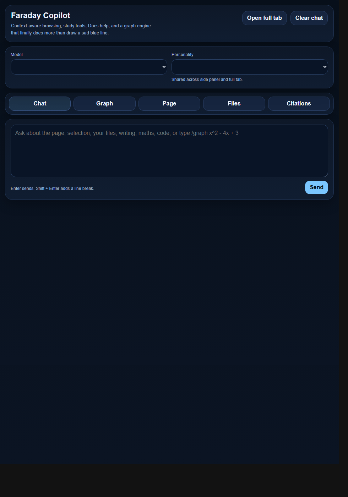
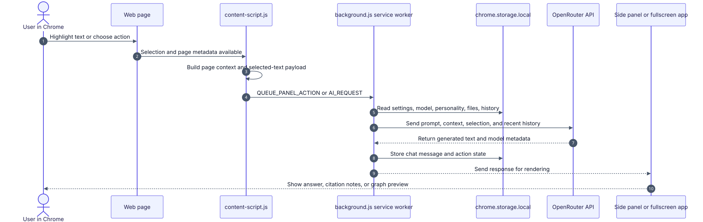

# Project 3 - Faraday Copilot

A Manifest V3 Chrome extension prototype that embeds AI research, writing, citation, Google Docs, file, and graphing workflows into the browser side panel and a fullscreen workspace.

## Review Summary

| Field | Evidence |
| --- | --- |
| **Status** | Completed prototype archive with version history |
| **Latest preserved build** | `Version History/09 - Faraday extension V8` |
| **Stack** | JavaScript, HTML, CSS, Chrome Manifest V3, service workers, content scripts, OpenRouter API, Google Apps Script, `chrome.storage.local`, canvas graph rendering |
| **Best evidence** | Source snapshots, technical architecture, employer summary, UI screenshots, code evidence excerpts, Mermaid diagrams |
| **Main technical value** | Browser extension architecture, AI API integration, stateful product workflows, Google Docs extraction strategy, and custom graphing logic |

## What It Does

Faraday Copilot brings page-aware AI assistance into Chrome. It can use page context and selected text, run writing/research/citation actions, store citation notes, switch models, work with files, support Google Docs through a companion script, and render mathematical graphing workflows.

## Technical Proof Points

- Built the main Manifest V3 surfaces: background service worker, content scripts, side panel, popup, options page, and fullscreen app.
- Integrated OpenRouter through an isolated API adapter with configurable model selection.
- Designed message routing between the content script, background worker, side panel, fullscreen app, and storage layer.
- Added page-context extraction from DOM metadata, headings, visible text, lists, tables, selected text, and Google Docs document IDs.
- Implemented a Google Apps Script companion after discovering that normal Google Docs DOM extraction was unreliable.
- Persisted settings, personalities, chat history, file payloads, citation notebook, page context, pending actions, and active views in `chrome.storage.local`.
- Built a graphing subsystem with expression parsing, implicit multiplication, AST evaluation, canvas rendering, zoom/pan, roots, stationary points, and intersections.
- Preserved a version trail that shows migration from local AI, OpenRouter adoption, Google Docs hardening, failed UI work, recovery, and V8 separation of fullscreen logic.

## What to Inspect First

- [Employer summary](./Documentation/Employer%20Summary.md) - fastest evidence map for reviewers.
- [Technical architecture](./Documentation/Technical%20Architecture.md) - architecture, modules, data flow, and security notes.
- [Version evolution](./Documentation/Version%20Evolution.md) - why each version exists and what changed.
- [Engineering evidence excerpts](./Evidence/Code%20Evidence/engineering-excerpts.md) - exact files that demonstrate the strongest implementation work.
- [Latest V8 source](./Version%20History/09%20-%20Faraday%20extension%20V8/) - final preserved extension build.
- [UI screenshots](./Evidence/Screenshots/) - side panel, settings, fullscreen workspace, and early local AI UI evidence.

## Latest Build Snapshot

The latest preserved version is [Version History/09 - Faraday extension V8](./Version%20History/09%20-%20Faraday%20extension%20V8/). Key files:

- [`manifest.json`](./Version%20History/09%20-%20Faraday%20extension%20V8/manifest.json) - Manifest V3 permissions, surfaces, background worker, and content scripts.
- [`background.js`](./Version%20History/09%20-%20Faraday%20extension%20V8/background.js) - orchestration, context menu actions, page context, settings, companion fetches, and AI request routing.
- [`content-script.js`](./Version%20History/09%20-%20Faraday%20extension%20V8/content-script.js) - page interaction, text selection tools, DOM extraction, and Google Docs detection.
- [`lib/openrouter.js`](./Version%20History/09%20-%20Faraday%20extension%20V8/lib/openrouter.js) - chat-completions API integration.
- [`lib/storage.js`](./Version%20History/09%20-%20Faraday%20extension%20V8/lib/storage.js) - default settings and persistent extension state.
- [`app.js`](./Version%20History/09%20-%20Faraday%20extension%20V8/app.js) - fullscreen workspace and graphing logic.
- [`apps-script/Code.gs`](./Version%20History/09%20-%20Faraday%20extension%20V8/apps-script/Code.gs) - Google Docs companion script.

## How to Inspect or Run

1. Open Chrome and go to `chrome://extensions`.
2. Enable `Developer mode`.
3. Click `Load unpacked`.
4. Select `Version History/09 - Faraday extension V8`.
5. Open extension settings and add an OpenRouter API key.
6. Optional: deploy the included Apps Script companion from `apps-script/` and paste its `/exec` URL into settings for Google Docs extraction.

## Limitations

- The API key is stored locally in `chrome.storage.local`; a production release should use a backend proxy.
- The Google Docs workflow depends on user-deployed Apps Script configuration.
- Screenshots are static evidence rather than automated extension test output.
- Production hardening would need automated tests, response streaming, permissions minimisation, privacy policy text, and packaged Chrome Web Store distribution.
