# Project 4 - GYLIO App (ONGOING)

GYLIO, short for Get Your Life In Order, is a behavioural productivity prototype that helps users start the day with intentional action instead of distraction.

## Review Summary

| Field | Evidence |
| --- | --- |
| **Status** | Ongoing product prototype |
| **Built** | Static web MVP, Expo React Native rebuild, and V1 UI revision |
| **Stack** | HTML, CSS, JavaScript, PWA basics, React Native, Expo, Expo Router, TypeScript, Supabase client, AsyncStorage, notifications, Expo Video |
| **Best evidence** | UI screenshots, versioned source folders, design brief, package files, service layer, alarm and activation screens |
| **Main technical value** | Product brief interpretation, frontend implementation, mobile app structure, service abstraction, local persistence, and UI iteration |

## Product Problem

Most productivity tools organise tasks after the user has already entered the day reactively. GYLIO targets the first interaction after waking: identity, motivation, and the next concrete action.

## Solution

The prototype combines a morning activation sequence with a lightweight execution dashboard. Users can select a trait, preview motivational training segments, launch a full-screen activation flow, track an alarm countdown, view daily schedule blocks, manage priority tasks, and journal progress.

## Technical Proof Points

- Built a no-install HTML/CSS/JavaScript MVP with data-driven UI rendering.
- Implemented trait selection, activation sequencing, alarm countdown logic, task completion scoring, and schedule rendering.
- Added PWA foundation files: web manifest, service worker, and app icon.
- Rebuilt the concept in Expo React Native with TypeScript and Expo Router.
- Added local persistence, notification scheduling, Supabase video lookup, fullscreen activation playback, calendar planning, daily tasks, and journaling.
- Refactored the UI toward a more consistent design system across alarm setup, activation, lesson dashboard, calendar, tasks, and journal screens.

## What to Inspect First

- [Engineering design brief](./ENGINEERING_DESIGN_BRIEF.md) - product purpose, objective, MVP systems, constraints, and skills.
- [Version 1 source](./version%201/) - static web MVP.
- [Version 1 run guide](./version%201/README.md) - no-build browser prototype.
- [Version 2 source](./version%202/) - Expo React Native rebuild.
- [Version 2 package file](./version%202/package.json) - dependencies and scripts.
- [V1 UI revision source](./V1%20UI%20revision/) - refined mobile UI direction.

## Evidence

### Version 1 Web MVP

### Version 2 Expo Prototype

## Limitations and Next Work

- The project is ongoing and has not been packaged as a production mobile release.
- Version 1 represents alarm-trigger behaviour as a prototype interaction; true wake-screen automation requires native platform handling.
- Version 2 is Supabase-ready but still needs production auth, content management, analytics, testing, and deployment decisions.

## Project Files

- [Engineering design brief](./ENGINEERING_DESIGN_BRIEF.md)
- [Version 1 source code](./version%201/)
- [Version 1 run guide](./version%201/README.md)
- [Version 2 source code](./version%202/)
- [Version 2 run guide](./version%202/README.md)
- [V1 UI revision source code](./V1%20UI%20revision/)
- [V1 UI revision run guide](./V1%20UI%20revision/README.md)
