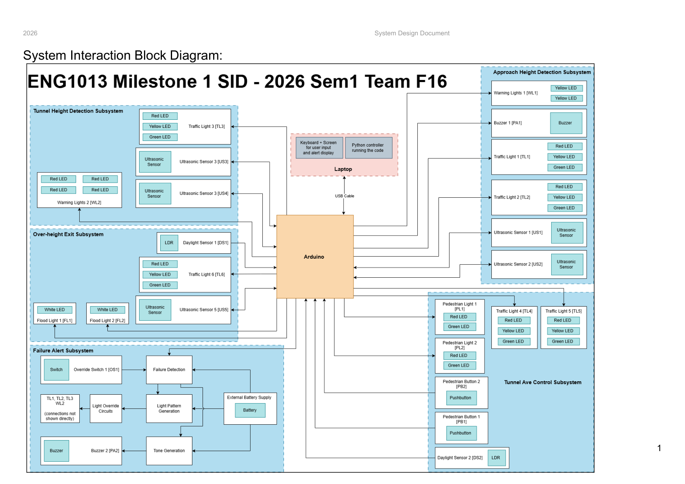
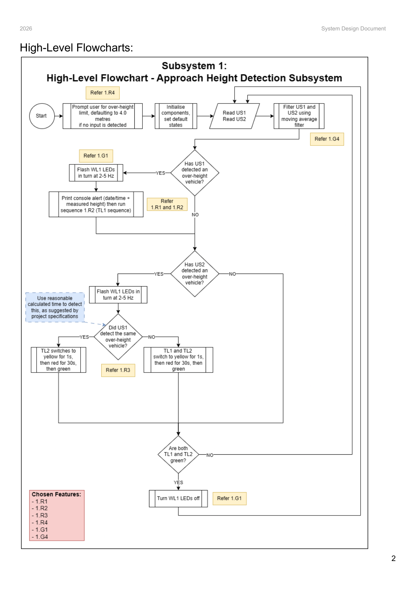
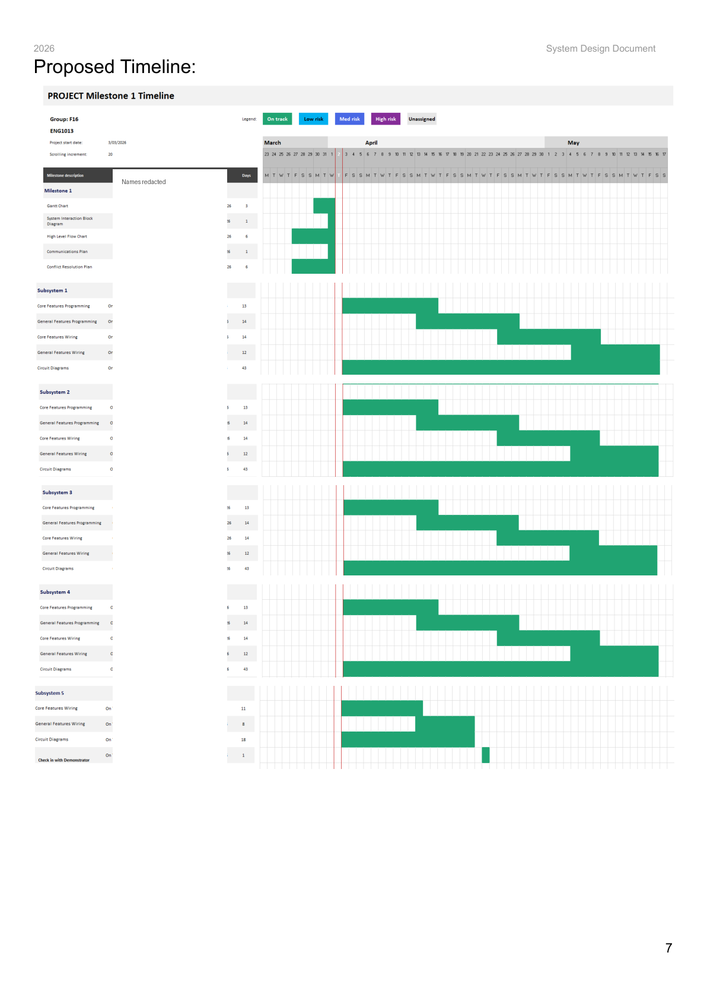

# Project 5 - ENG1013 Assignment (ONGOING)

Status: Ongoing. Milestone 1 planning evidence has been completed and preserved; later build, integration, demonstration, and viva evidence will be added as the assignment progresses.

ENG1013 is a smart-systems engineering assignment focused on designing, building, and demonstrating a simplified traffic-control safety system for the Blackwall Tunnel southern approach. The system is intended to reduce over-height vehicle collision risk by detecting vehicle height, warning drivers, managing traffic and pedestrian lights, providing an over-height exit path, and failing safely if the tunnel-height detection subsystem loses power.

This portfolio folder captures the assignment requirements, a concise project overview PDF, and Team F16's Milestone 1 System Design Document evidence. The public portfolio copy redacts student IDs, staff email details, and individual team member names from the preserved Milestone 1 source document and timeline screenshot.

## Current Stage

The project is currently in the transition from Milestone 1 planning into later implementation. The available evidence shows requirement extraction, system decomposition, hardware interaction planning, high-level subsystem logic, project scheduling, communication planning, and conflict-resolution planning.

## Problem

Over-height vehicles present a safety risk when approaching tunnel entrances with fixed clearance limits. This assignment models that safety problem through a simplified traffic-control system that must identify over-height vehicles, prevent unsafe tunnel entry, manage nearby traffic flows, and provide a hardware-only failure response.

## Solution Direction

The planned system is divided into five subsystems:

- Approach Height Detection Subsystem: detects over-height vehicles before the exit and controls warning signals.
- Tunnel Ave Control Subsystem: manages Tunnel Ave traffic lights and pedestrian crossings.
- Over-height Exit Subsystem: allows detected over-height vehicles to leave the route before the tunnel.
- Tunnel Height Detection Subsystem: provides a final detection and closure point at the tunnel entrance.
- Failure Alert Subsystem: provides a hardware-only alert and override path during power failure.

## Milestone 1 Evidence

Milestone 1 produced a System Design Document containing:

- A system interaction block diagram showing Arduino, laptop, sensors, lights, buttons, buzzers, battery, and hardware override circuits.
- High-level flowcharts for Subsystems 1 to 4.
- A feature-selection page for the hardware-only Failure Alert Subsystem.
- A proposed timeline covering programming, wiring, circuit diagrams, and demonstrator check-in work.
- A communications plan using primary, secondary, and backup communication channels.
- A conflict resolution plan covering disagreements, low-quality work, incomplete work, late work, and lack of participation.
- A meeting-minutes template for later project-management evidence.

## Technical Highlights

- Extracted and condensed a 30-page assignment specification into a seven-page overview PDF.
- Preserved original assignment requirements alongside portfolio-friendly summaries.
- Converted official and team PDF pages into screenshot evidence.
- Mapped the assignment into five subsystem responsibilities and milestone deliverables.
- Documented feature IDs selected during Milestone 1 for later traceability into code and circuit evidence.
- Redacted public portfolio copies to avoid publishing student IDs, staff email details, and team member names.

## Key Evidence

## Project Files

- [Project overview PDF](./Project%20Overview.pdf)
- [Requirements summary](./Documentation/Requirements%20Summary.md)
- [Milestone 1 summary](./Documentation/Milestone%201%20Summary.md)
- [Engineering design brief](./ENGINEERING_DESIGN_BRIEF.md)
- [Evidence index](./Evidence/README.md)
- [Original assignment specification](./Original%20Documents/ENG1013%20Traffic%20System%20Project%20Specification.pdf)
- [Redacted Milestone 1 System Design Document](./Original%20Documents/TeamF16%20Milestone%201%20System%20Design%20Document%20-%20Redacted.pdf)

## Next Portfolio Updates

- Add circuit diagrams for each implemented function.
- Add Python source snapshots for the final integrated system.
- Add photos or screenshots from the physical prototype and Week 11 demonstration.
- Add viva/reflection notes after Milestone 3 is complete.
- Update this folder from ongoing to complete once final marking evidence and reflection artifacts are available.
