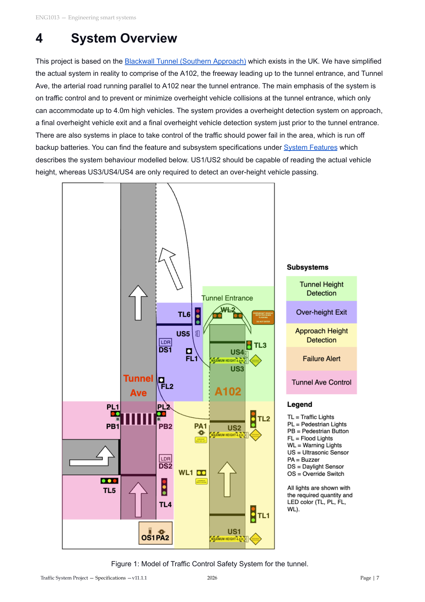
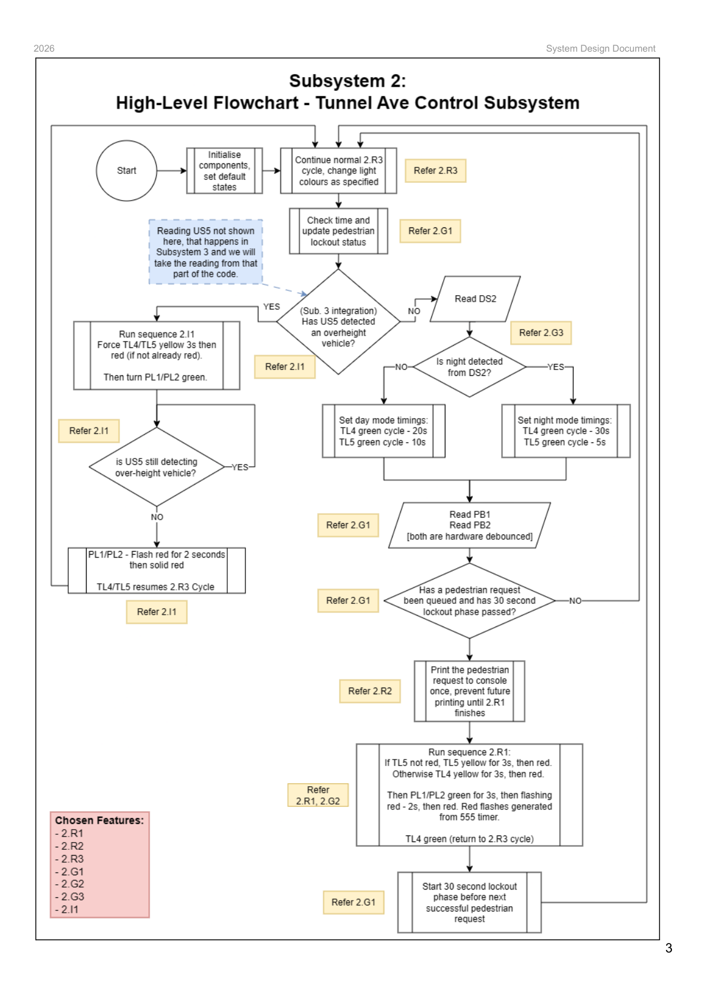
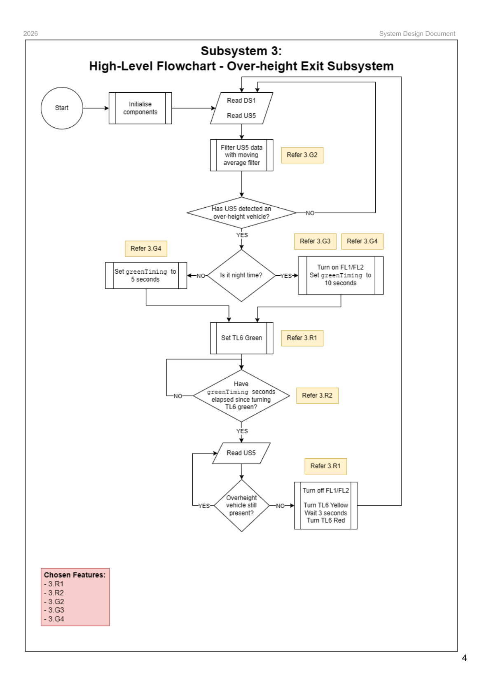
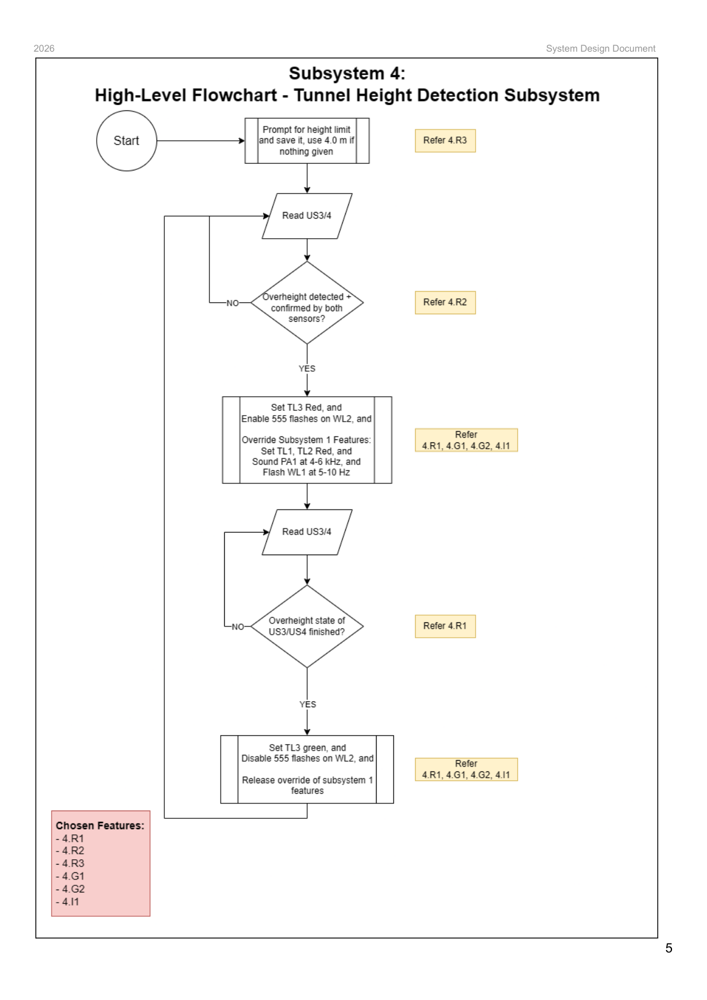

# Project 5 - ENG1013 Assignment (ONGOING)

An Arduino-linked smart traffic-control assignment that models over-height vehicle detection and diversion for the Blackwall Tunnel southern approach. The portfolio evidence covers requirement extraction, system decomposition, Python control code, wiring notes, circuit diagrams, prototype photos, and working-system videos.

## Review Summary

| Field | Evidence |
| --- | --- |
| **Status** | Ongoing. Build/integration evidence is present; final viva/reflection evidence is still future work. |
| **Built** | Simplified traffic safety demonstrator with height sensing, warning outputs, traffic lights, pedestrian signals, over-height exit logic, and failure-alert planning |
| **Stack and hardware** | Python 3.10.x, Pymata4, Arduino, ultrasonic sensors, LDRs, push buttons, LEDs, buzzers, shift registers, breadboard wiring, oscilloscope/function-generator testing |
| **Best evidence** | Requirements summary, Milestone 1 planning screenshots, integrated Python source, wiring guides, exported circuit diagrams, photos, and MP4 demonstrations |
| **Main technical value** | Requirements traceability, hardware/software integration, sensor-driven control logic, circuit documentation, and public evidence curation |

## Assignment Context

The system models a tunnel approach where over-height vehicles must be detected and redirected before reaching a 4.0 m clearance limit. The simplified demonstrator uses sensors, lights, buttons, buzzers, day/night detection, and failure-alert circuitry to show the required safety behaviours.

## System Scope

The assignment is divided into five subsystems:

| Subsystem | Responsibility |
| --- | --- |
| **1. Approach Height Detection** | Detect over-height vehicles before the exit and trigger warnings. |
| **2. Tunnel Ave Control** | Manage Tunnel Ave traffic lights and pedestrian crossing behaviour. |
| **3. Over-height Exit** | Allow detected over-height vehicles to leave the route before the tunnel. |
| **4. Tunnel Height Detection** | Provide a final detection and closure point at the tunnel entrance. |
| **5. Failure Alert** | Provide a hardware-only alert and override path during detection power failure. |

## Technical Proof Points

- Condensed the official assignment specification into a reviewer-friendly requirements overview.
- Preserved Milestone 1 planning evidence: system interaction block diagram, subsystem flowcharts, feature selection, schedule, communication plan, and conflict resolution plan.
- Preserved Python source snapshots for final integration and earlier staged subsystem builds.
- Added wiring notes for integrated subsystem builds and Subsystem 3.
- Exported 24 circuit-diagram pages from the latest redacted circuit PDF into reviewable PNG evidence.
- Added physical prototype photos covering lab integration, oscilloscope/function-generator testing, full breadboard wiring, and LDR/LED close-up evidence.
- Added five demonstration videos from the working Arduino traffic-control system.
- Redacted public copies to remove student IDs, staff email details, and individual team member names where practical.

## What to Inspect First

- [Requirements summary](./Documentation/Requirements%20Summary.md) - mission, restrictions, milestones, and subsystem requirements.
- [Build and integration summary](./Documentation/Build%20and%20Integration%20Summary.md) - implementation, hardware, code, and video evidence.
- [Code index](./Code/README.md) - final integrated source and earlier snapshots.
- [Circuit diagram index](./Circuit%20Diagrams/README.md) - redacted circuit files and exported PNG evidence.
- [Evidence index](./Evidence/README.md) - screenshots, photos, videos, and source document notes.
- [Engineering design brief](./ENGINEERING_DESIGN_BRIEF.md) - objective, constraints, current outcome, and skills.

## Key Evidence

High-level subsystem flowcharts

Subsystem 2 circuit diagrams

Subsystem 3 circuit diagrams

## Run Context

The code is hardware-facing. It expects the ENG1013 Arduino/breadboard setup, Python 3.10.x, Pymata4, and the assignment-approved hardware package. The repository preserves code as implementation evidence rather than as a software-only project that can be run without the physical build.

## Limitations and Next Portfolio Updates

- Add viva/reflection notes after Milestone 3 is complete.
- Mark the project complete once final marking evidence and reflection artifacts are available.
- Add a traceability matrix linking official feature IDs to code files, circuit sheets, and demonstration clips.

## Project Files

- [Project overview PDF](./Project%20Overview.pdf)
- [Requirements summary](./Documentation/Requirements%20Summary.md)
- [Milestone 1 summary](./Documentation/Milestone%201%20Summary.md)
- [Build and integration summary](./Documentation/Build%20and%20Integration%20Summary.md)
- [Engineering design brief](./ENGINEERING_DESIGN_BRIEF.md)
- [Code index](./Code/README.md)
- [Circuit diagram index](./Circuit%20Diagrams/README.md)
- [Evidence index](./Evidence/README.md)
- [Prototype photo index](./Evidence/Photos/README.md)
- [Demonstration video index](./Evidence/Videos/README.md)
- [Original assignment specification](./Original%20Documents/ENG1013%20Traffic%20System%20Project%20Specification.pdf)
- [Redacted Milestone 1 System Design Document](./Original%20Documents/TeamF16%20Milestone%201%20System%20Design%20Document%20-%20Redacted.pdf)
