# Engineering Portfolio

Evidence-first engineering portfolio for practical software, hardware, and systems projects. Each project is organised as a case study with a clear problem, the implemented solution, technical evidence, and the exact files a reviewer should inspect first.

## Fast Review

- **Best software engineering evidence:** [Faraday Copilot](./Project%203%20-%20Faraday%20Copilot/) - Manifest V3 Chrome extension, OpenRouter integration, Google Docs companion, persistent browser state, and a custom graphing workspace.
- **Best hardware/control evidence:** [ENG1013 Assignment](./Project%205%20-%20ENG1013%20assignment%20%28ONGOING%29/) - Arduino/Python traffic-control prototype with sensors, lights, wiring notes, circuit diagrams, photos, and demonstration videos.
- **Best mechanical design evidence:** [Gearbox Model](./Project%201%20-%20Gearbox%20Model/) - physical model gearbox with CAD evidence, system diagrams, fabrication constraints, and diagnostic testing.
- **Best product/frontend evidence:** [GYLIO App](./Project%204%20-%20GYLIO%20App%20%28ONGOING%29/) - web prototype, Expo React Native rebuild, Supabase-ready services, notification flow, and UI evidence.
- **Best systems communication evidence:** [Light Refraction System](./Project%202%20-%20Light%20Refraction%20System/) - reports, CAD revisions, block diagrams, and flowcharts for a reviewable engineering concept.

## Project Evidence Map

| Project | What I built | Technical evidence | Start here |
| --- | --- | --- | --- |
| [1. Gearbox Model](./Project%201%20-%20Gearbox%20Model/) | A classroom model gearbox for explaining gear ratios, shaft alignment, gear meshing, and synchroniser movement. | Full systems report, CAD renders, block flow diagram, high-level flowchart, gear-ratio planning map, and design brief. | [Project README](./Project%201%20-%20Gearbox%20Model/README.md), [design brief](./Project%201%20-%20Gearbox%20Model/ENGINEERING_DESIGN_BRIEF.md) |
| [2. Light Refraction System](./Project%202%20-%20Light%20Refraction%20System/) | A systems engineering communication package for a light-path/refraction tool concept. | Full report, overview PDF, Draw.io block diagram, high-level flowchart, and Fusion 360 CAD model revisions. | [Project README](./Project%202%20-%20Light%20Refraction%20System/README.md), [design brief](./Project%202%20-%20Light%20Refraction%20System/ENGINEERING_DESIGN_BRIEF.md) |
| [3. Faraday Copilot](./Project%203%20-%20Faraday%20Copilot/) | A browser-native AI copilot prototype in a Chrome side panel and fullscreen workspace. | Versioned source snapshots, Manifest V3 architecture, OpenRouter adapter, Google Apps Script bridge, UI screenshots, code evidence, and Mermaid architecture diagrams. | [Project README](./Project%203%20-%20Faraday%20Copilot/README.md), [employer summary](./Project%203%20-%20Faraday%20Copilot/Documentation/Employer%20Summary.md), [technical architecture](./Project%203%20-%20Faraday%20Copilot/Documentation/Technical%20Architecture.md) |
| [4. GYLIO App](./Project%204%20-%20GYLIO%20App%20%28ONGOING%29/) | A behavioural productivity prototype across a static web MVP and Expo React Native mobile rebuild. | HTML/CSS/JS prototype, TypeScript/Expo app, Supabase service layer, local persistence, notification scheduling, and UI screenshots. | [Project README](./Project%204%20-%20GYLIO%20App%20%28ONGOING%29/README.md), [version 2 source](./Project%204%20-%20GYLIO%20App%20%28ONGOING%29/version%202/) |
| [5. ENG1013 Assignment](./Project%205%20-%20ENG1013%20assignment%20%28ONGOING%29/) | A smart traffic-control safety prototype for over-height vehicle detection and diversion. | Python/Pymata4 source, Arduino wiring notes, exported circuit diagrams, prototype photos, videos, requirement summaries, and redacted planning documents. | [Project README](./Project%205%20-%20ENG1013%20assignment%20%28ONGOING%29/README.md), [code index](./Project%205%20-%20ENG1013%20assignment%20%28ONGOING%29/Code/README.md), [evidence index](./Project%205%20-%20ENG1013%20assignment%20%28ONGOING%29/Evidence/README.md) |

## Technical Range

| Area | Evidence in this repository |
| --- | --- |
| Software engineering | Chrome extension source, browser messaging, JavaScript modules, TypeScript/Expo app structure, local persistence, API adapter design, and frontend state/rendering logic. |
| AI/API integration | OpenRouter chat-completions adapter, model selection settings, prompt/context assembly, Google Docs companion extraction, and AI-assisted workflow design. |
| Hardware and control systems | Arduino-linked Python control, Pymata4 hardware communication, ultrasonic sensing, LDR day/night detection, traffic-light sequencing, warning lights, and physical breadboard integration. |
| Mechanical and CAD design | Fusion 360 CAD evidence, gear-ratio planning, 3D printed gear constraints, shaft/bearing layout, and physical prototype review. |
| Technical communication | Design briefs, full reports, system diagrams, flowcharts, wiring guides, evidence indexes, public redaction notes, and reviewer-facing summaries. |

## How to Review

1. Use this README to choose a project by evidence type.
2. Open the project README for the concise case study.
3. Inspect the linked design brief, architecture document, code index, or evidence folder.
4. Use the reports, screenshots, photos, videos, and source snapshots to verify the claims.

## Repository Notes

- This GitHub account currently has one public repository: `Addmiy/Engineering-Portfolio`.
- A GitHub profile README repository named `Addmiy/Addmiy` does not currently exist. A profile README draft is included in [PROFILE_README_DRAFT.md](./PROFILE_README_DRAFT.md).
- Some assets are binary evidence files, including PDFs, Fusion 360 files, images, and MP4 demonstrations. GitHub can store them, but not every format previews inline.
- A presentation audit and recommended future diagrams are documented in [GITHUB_PRESENTATION_AUDIT.md](./GITHUB_PRESENTATION_AUDIT.md).
