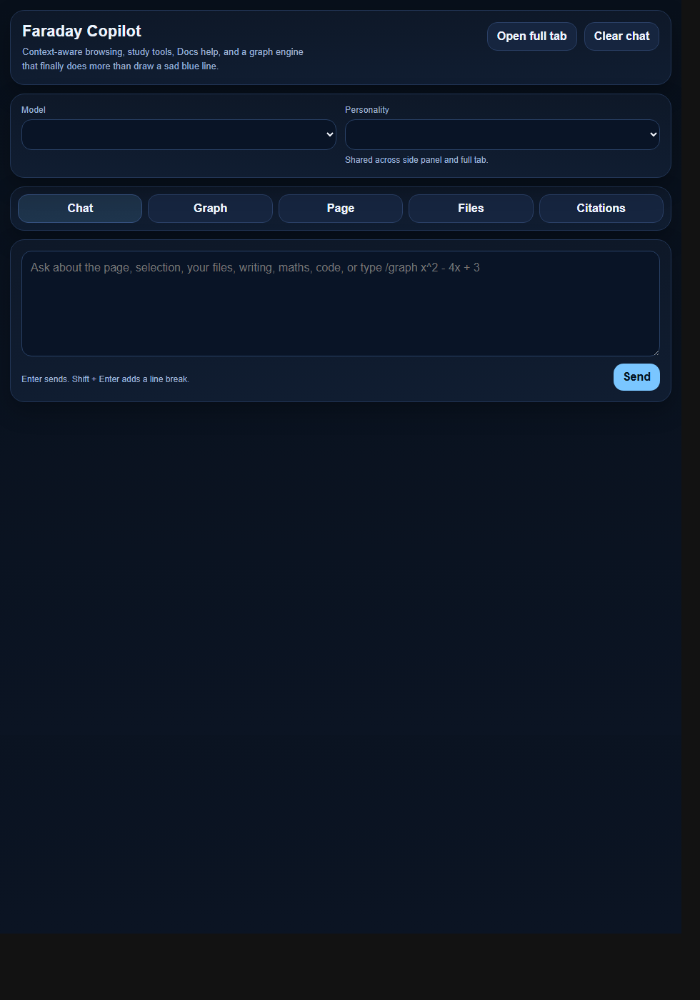

# Project 4 - Faraday Copilot

Faraday Copilot is a Manifest V3 Chrome extension prototype for a browser-native AI copilot. It brings page-aware chat, highlighted-text actions, citations, Google Docs assistance, file-aware prompts, model switching, and a maths graphing workspace into the Chrome side panel and a fullscreen app view.

This portfolio folder preserves the full development trail from the original local Chrome AI prototype through the OpenRouter-powered Faraday builds. The project is included to demonstrate practical Chrome extension engineering, AI API integration, user-interface iteration, state management, Google Docs integration experiments, and analytical tool building with vanilla JavaScript.

## Portfolio contents

- `Version History/` contains copied source snapshots for each discovered project version.
- `Documentation/Project Overview.md` explains the project purpose, architecture, feature set, and engineering growth over time.
- `Documentation/Version Evolution.md` documents the revision history and what changed between versions.
- `Documentation/Design Brief.md` frames the project professionally for an employer or assessor.
- `Documentation/Employer Summary.md` gives a fast reviewer-facing summary of skills and best files to inspect.
- `Documentation/Technical Architecture.md` outlines the extension architecture, data flow, and major modules.
- `Evidence/` contains UI screenshots and code evidence notes.
- `Diagrams/` contains Mermaid source diagrams for the system architecture and version timeline.

## Final prototype snapshot

The latest preserved version is `Version History/09 - Faraday extension V8`. It includes:

- Manifest V3 extension architecture with background service worker, content scripts, side panel, options page, popup, and fullscreen app page.
- OpenRouter chat-completions integration with configurable model selection.
- Page context extraction from standard webpages and structured Google Docs companion snapshots.
- Highlight toolbar actions for explanation, summaries, questions, citations, flashcards, and notes.
- Persistent chat, settings, file payloads, citation notebook, and graph expressions through `chrome.storage.local`.
- A tabbed side-panel interface and rebuilt fullscreen workspace.
- A custom graph engine with parsing, plotting, zoom/pan, intercept detection, stationary point detection, and multi-function intersections.

## Key evidence

More screenshots are in `Evidence/Screenshots/`, and implementation excerpts are in `Evidence/Code Evidence/engineering-excerpts.md`.

## How to inspect or run the latest extension

1. Open Chrome and go to `chrome://extensions`.
2. Enable `Developer mode`.
3. Click `Load unpacked`.
4. Select `Version History/09 - Faraday extension V8`.
5. Open the extension settings and add an OpenRouter API key.
6. Optional: deploy the included Apps Script companion from `apps-script/` and paste its `/exec` URL into settings for Google Docs extraction.

## Prototype limitations

This project was developed as a personal engineering prototype, not a production release. The API key is stored locally in `chrome.storage.local`, the Google Docs integration depends on deployment/configuration of an Apps Script companion, and UI screenshots in this portfolio are static captures of extension pages rather than authenticated browser-extension runtime sessions.

## Employer-facing summary

Faraday Copilot shows the ability to take an idea from prototype to increasingly capable product: integrating AI services, designing Chrome extension messaging flows, building UI from scratch, managing client-side persistence, handling hostile third-party document surfaces, and iterating after failed interface experiments.
